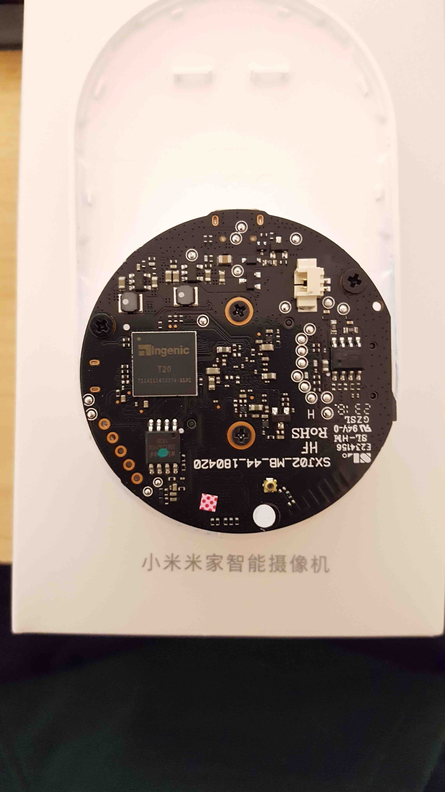
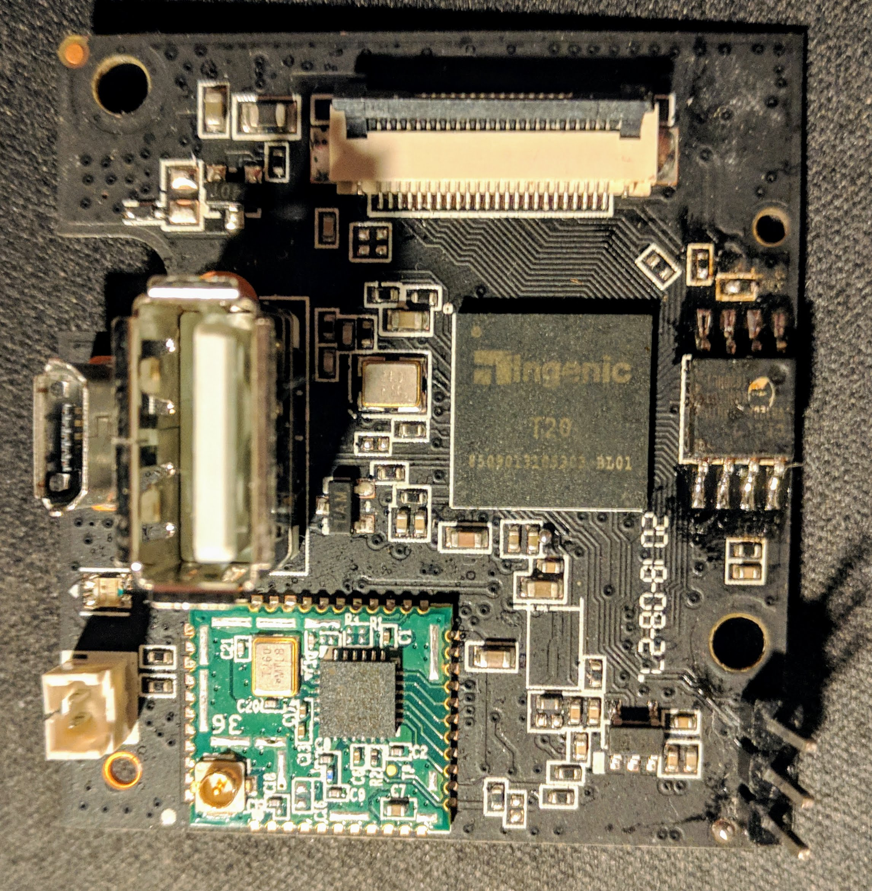
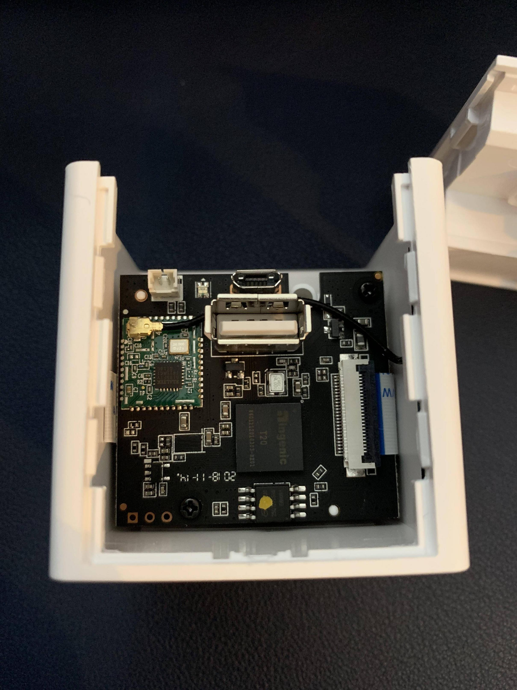

# Overview

This document attempts to merge all information as a technical description.

| Camera                  | ID       | Picture                                | SOC  |Wireless    | FLASH      | GPIO                                                  | Notes                  |
|-------------------------|----------|----------------------------------------|------|------------|------------|-------------------------------------------------------|------------------------|
| Xiaomi Mijia 2018       | SXJ02ZM  |    | T20L |8189FTV     |            | b_led_pin 76; y_led_pin 75; ir_pin 72;                | motor:false; usb:false |
| Xiaomi Xiaofang 1S      |          |  | T20L |8189FTV     | EN25QH128A |                                                       | motor:false            |
| Xiaomi Dafang           |          |                                        | T20X |            |            | usb_en_pin 77; b_led_pin 39; y_led_pin 38; ir_pin 49; |                        |
| Wyze Cam V2             | WYZEC2   |         | T20X |8189FTV     |            | usb_en_pin 77; b_led_pin 39; y_led_pin 38; ir_pin 49; | motor:false            |
| Wyze Cam Pan            | WYZECP1  |                                        | T20X |            |            | usb_en_pin 77; b_led_pin 39; y_led_pin 38; ir_pin 49; |                        |
